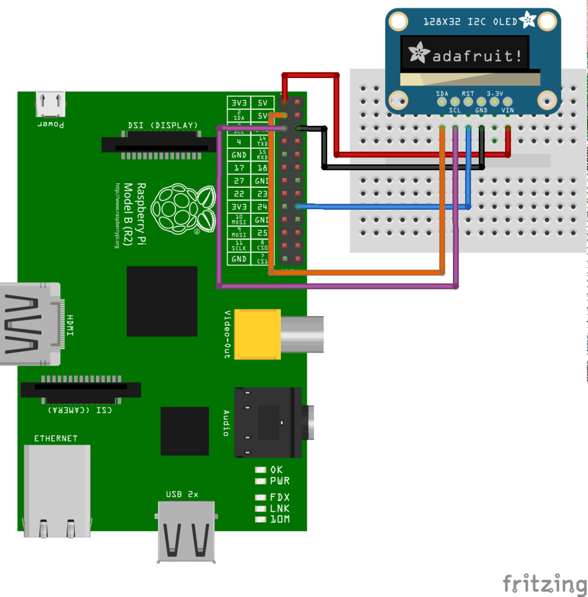
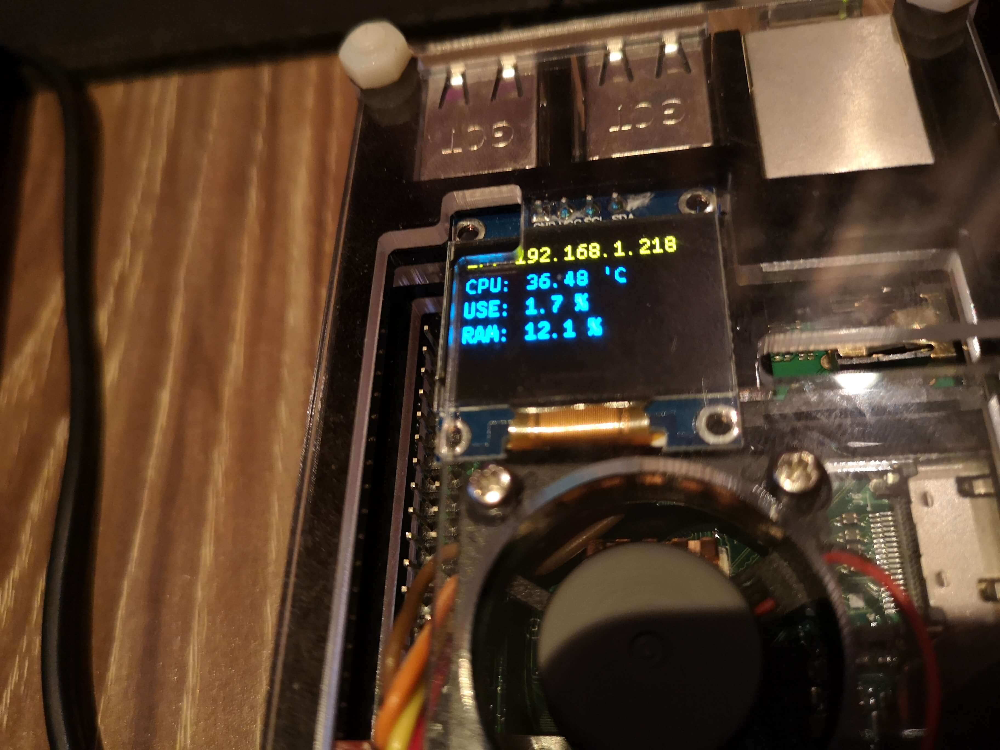

# raspberrypi-oled-dashboard
树莓派驱动oled显示屏，监控系统状态

## 前置条件
- 树莓派一块
- 官方 raspbian 系统
- SSD 1306 oled 显示器一块

## I2C 引脚连接
- [参考](https://learn.adafruit.com/ssd1306-oled-displays-with-raspberry-pi-and-beaglebone-black?view=all)



## 安装
```bash
# 安装到 root 目录
cd /root

git clone https://github.com/lanten/raspberrypi-oled-dashboard.git
cd raspberrypi-oled-dashboard
bash init.sh
```

## 启用 I2C
执行以下命令进入树莓派配置
```bash
raspi-config
```
选择：`Interfacing Options > P5 I2C` 启用

查看硬件状态：
```bash
sudo i2cdetect -y 1
```


## 启动
```bash
bash /root/raspberrypi-oled-dashboard/start.sh
```

## 设置开机启动
编辑文件：
```bash
nano /etc/rc.local
```

在 `exit 0` 前写入以下内容

```bash
bash /root/raspberrypi-oled-dashboard/start.sh;
```

<kbd>ctrl</kbd> + <kbd>O</kbd> 保存
<kbd>ctrl</kbd> + <kbd>X</kbd> 退出

## 最终效果
